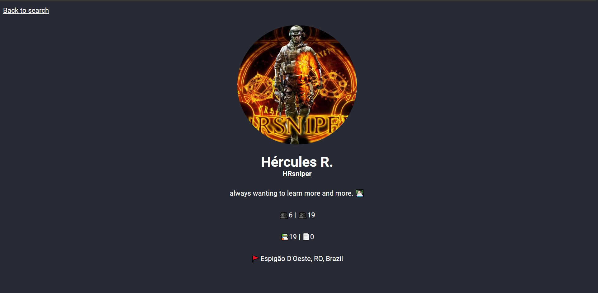

# NextJs com Typescript

- [NextJs com Typescript](#nextjs-com-typescript)
  - [Iniciar projeto em modo de desenvolvimento](#iniciar-projeto-em-modo-de-desenvolvimento)
  - [Construir o projeto](#construir-o-projeto)
  - [Iniciar o projeto no modo de produção](#iniciar-o-projeto-no-modo-de-produção)
  - [Exporte o projeto](#exporte-o-projeto)

- [Readme in English](../../readme.md)




---

---

## Iniciar projeto em modo de desenvolvimento

```
npm run dev
or
yarn dev
```

## Construir o projeto

`next build` constrói o aplicativo para uso em produção.

```
npm run build
or
yarn build
```

## Iniciar o projeto no modo de produção

```
npm run start
or
yarn start
```

## Exporte o projeto

`next export` permite que você exporte seu aplicativo para HTML estático, que pode ser executado de forma autônoma, sem a necessidade de um servidor Node.js. No entanto terá que mudar `fallback: true` para `fallback: false`.

Por padrão, `next export` irá gerar um diretório `out`, que pode ser servido por qualquer serviço de hospedagem estática ou CDN.

```
npm run export
or
yarn export
```
