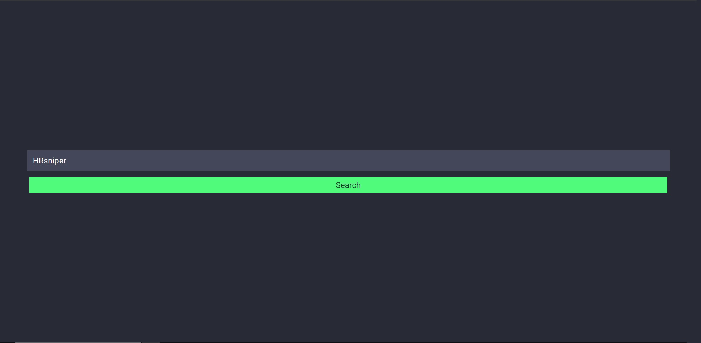
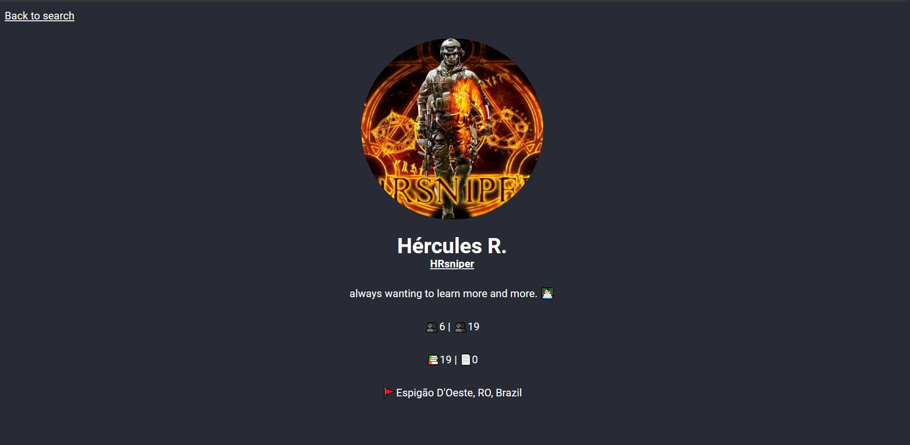

# NextJs with Typescript

- [NextJs with Typescript](#nextjs-with-typescript)
  - [Start project in development mode](#start-project-in-development-mode)
  - [Build the project](#build-the-project)
  - [Start project in production mode](#start-project-in-production-mode)
  - [Export the project](#export-the-project)

- [Readme em Português](.github/pt-br/readme.md)





---

---

## Start project in development mode

```
npm run dev
or
yarn dev
```

## Build the project

`next build` builds the application for use in production.

```
npm run build
or
yarn build
```

## Start project in production mode

```
npm run start
or
yarn start
```

## Export the project

`next export` allows you to export your application to static HTML, which can be run autonomously, without the need for a Node.js server. However, you will have to change `fallback: true` to `fallback: false`.

By default, `next export` will generate an `out` directory, which can be served by any static hosting service or CDN.

```
npm run export
or
yarn export
```
